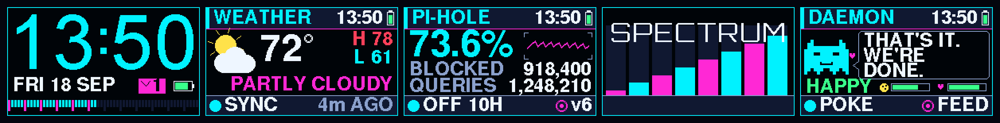
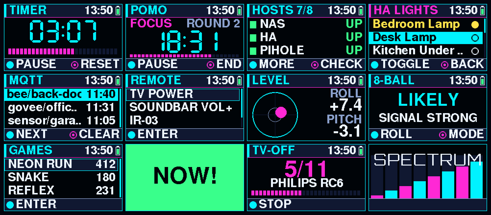
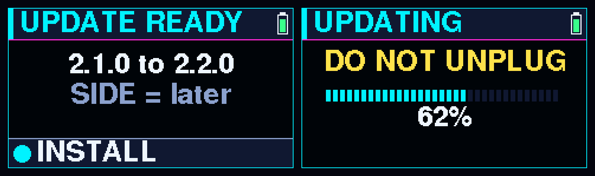
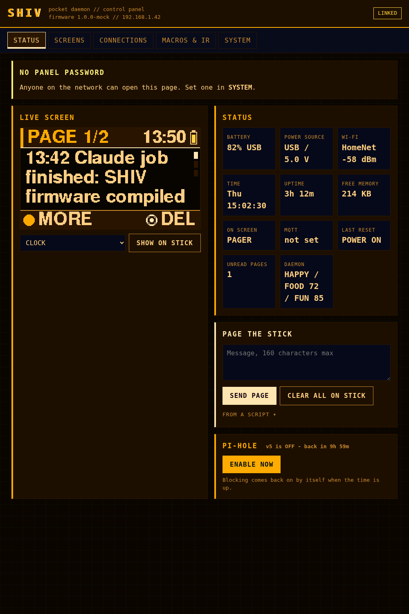

<div align="center">

# ◢◤ SHIV ◢◤
### a pocket daemon for the M5Stack StickS3

**Two buttons. One tiny screen. A whole networked toolkit in your pocket.**

SHIV turns a $20 keychain gadget into a cyberpunk multitool — a clock and a weather
station, a Pi-hole remote, a Home Assistant controller, a Wi-Fi/BLE/IR scanner, a
handful of games, a little pet that watches the room, and firmware that **updates
itself over the air**. All driven by two buttons and a web panel it hosts on your LAN.

`FRONT` acts · `SIDE` moves · hold `SIDE` = GO TO menu · hold `FRONT` = back



</div>

---

## What it does

A quick tour — every one of these is a screen you flip to with the SIDE button, or jump to from the **GO TO** menu.

| | | |
|---|---|---|
| **🕛 Clock** — big neon clock, several faces, date + battery | **⏱ Timer / Pomodoro** — countdowns and focus/break cycles | **🌤 Weather** — live conditions + hi/lo, no API key (open-meteo) |
| **🛡 Pi-hole** — queries, % blocked, 24 h graph, one-press pause | **🖧 Hosts** — up/down for the boxes on your LAN | **🛒 Shopify / 📋 Jobs** — orders tile + a JSON ticker |
| **🏠 Home Assistant** — browse & toggle entities, scenes, favorites | **⚡ Macros** — fire any HTTP/webhook with a button | **📟 Pager / 🔔 Doorbell** — push a message or a camera ring to the screen |
| **📡 MQTT** — scroll live broker traffic | **📶 Wi-Fi / Channels** — scanner + channel congestion | **📲 BLE** — nearby Bluetooth devices, strongest first |
| **📺 IR Remote** — learn & replay codes; TV-B-Gone sweep | **📐 Level / 🎱 Oracle** — bubble level + a magic 8-ball | **🎮 Games** — tilt-dodger, snake, reflex |
| **👾 Daemon** — a virtual pet that ages, sulks, and reacts to the room | **🎚 Spectrum** — a live neon audio spectrum off the mic | **🔄 Self-update** — see below |

<div align="center">

</div>

### 🔄 It updates itself

Point SHIV at a firmware manifest on your network and it checks for new builds on its
own. When one shows up, a card appears on the screen:

```
   UPDATE READY
   1.0.0 to 1.1.0
   [ INSTALL ]   SIDE = later
```

Press **FRONT** and it downloads the new firmware, flashes it with a progress bar,
and reboots into the new version — **no cable, no laptop.** It fails safe (a dropped
Wi-Fi or a bad download keeps the old firmware) and never installs anything without
your press.

<div align="center">

</div>

### 🎛 A web panel it hosts itself

SHIV runs a little web server on your LAN. Open its IP and you get a full control panel —
configure Wi-Fi, Pi-hole, Home Assistant, MQTT, hosts, macros, themes, the microphone,
and auto-update, all from your phone or desktop. First boot with no Wi-Fi? It opens a
captive-portal hotspot so you can get it online.

<div align="center">

</div>

---

## The hardware

SHIV runs on the **[M5Stack StickS3](https://docs.m5stack.com/)** — an ESP32-S3 keychain stick with a 1.14" 240×135 IPS screen, two buttons, an IMU, a mic, an IR blaster, and Wi-Fi + BLE. ~8 MB flash, 8 MB PSRAM.

> No StickS3 yet? The code is a standard Arduino/ESP32 sketch — most of it is portable to other ESP32-S3 boards with a screen, though the pin map and the M5Unified calls assume the StickS3.

---

## Install

### Easiest — the flash kit (Windows, no toolchain)
1. Grab a release `SHIV-x.y.z.zip` and unzip it.
2. Plug the StickS3 in over USB-C.
3. Run `FLASH-NO-COMPILE/flash.bat`. Done — it auto-detects the port and flashes.

### From the web panel (once you're on 1.0.0+)
Open the panel → **SYSTEM → FIRMWARE UPDATE** → pick the `.bin` → **UPLOAD & FLASH**. Or set an update manifest URL under **AUTO-UPDATE** and let the stick pull new versions itself.

### From source (Arduino / arduino-cli)
```bash
# board support: M5Stack's ESP32 package; libraries: M5Unified, M5GFX, ArduinoJson, PubSubClient
arduino-cli compile --fqbn "m5stack:esp32:m5stack_sticks3:PartitionScheme=default_8MB,PSRAM=opi,CDCOnBoot=cdc" SHIV
arduino-cli upload  --fqbn "m5stack:esp32:m5stack_sticks3:PartitionScheme=default_8MB,PSRAM=opi,CDCOnBoot=cdc" -p /dev/ttyACM0 SHIV
```
After a first flash, open the panel (or the SYSTEM → WIFI SETUP hotspot) and set your Wi-Fi, then the services you want. Everything is off until you configure it — the defaults are placeholders like `http://<home-assistant-ip>:8123`.

---

## First run

1. **Wi-Fi.** No saved network → SHIV opens a `SHIV-setup` hotspot; join it and the captive page lets you pick your network. It remembers up to 5.
2. **Pick your screens.** Panel → SCREENS turns screens on/off and sets the SIDE-button loop.
3. **Wire up services.** Panel → CONNECTIONS: Pi-hole URL + token, Home Assistant URL + long-lived token, MQTT broker, your LAN hosts, Home Assistant favorites and macros.
4. **Make it yours.** SYSTEM has 7 themes, brightness, sleep, and the microphone toggles (spectrum face + "the daemon hears the room").

---

## Build & test

Host tests and a headless render/panel harness live in `tools/`. See [`docs/development.md`](docs/development.md).

```bash
g++ -std=c++17 -o /tmp/t tools/test_pet.cpp && /tmp/t     # logic tests
g++ -std=c++17 -o /tmp/a tools/test_ago.cpp && /tmp/a     # time-math tests
tools/render/run.sh                                        # render every screen, audit legibility
tools/test_panel.sh                                        # drive the real web panel headless
```

Docs: [hardware](docs/hardware.md) · [development](docs/development.md) · [web API](docs/web-api.md) · [Home Assistant](docs/home-assistant.md)

---

<div align="center">

**SHIV** · MIT licensed · built for the StickS3 · version shown on the boot screen

*two buttons, no cloud, your network*

</div>
